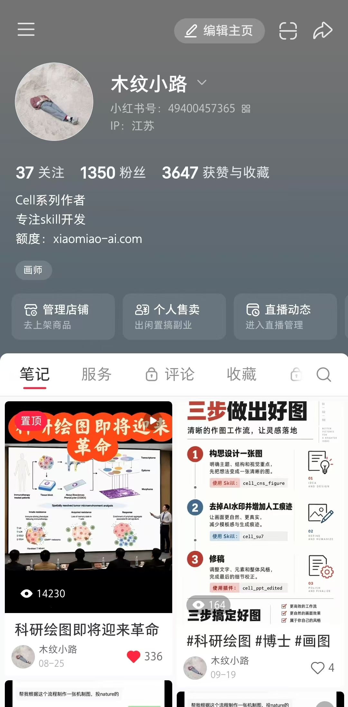
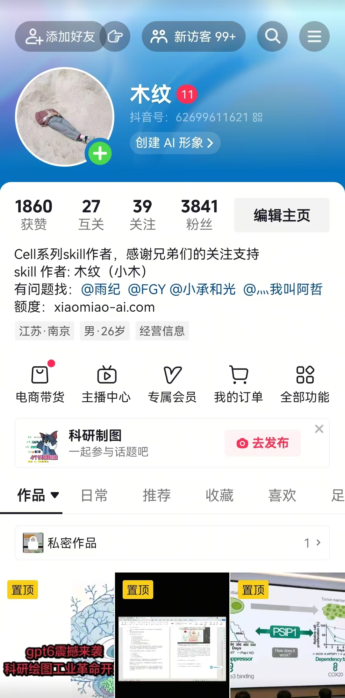

# Cell

[联系方式](#联系方式与社区) · [项目介绍](#项目发起人与运营信息) · [快速开始](#快速开始) · [安装与使用](#安装与使用) · [功能索引](#cell-功能索引) · [参与贡献](#参与贡献) · [教程与交流](#教程与交流)

---

## 联系方式与社区

使用 Cell 时遇到问题，可以通过以下公开账号联系我们。添加好友或进群时请备注 **Cell 使用交流**，并简单说明使用了哪项功能、遇到了什么问题。

<table>
  <tr>
    <td align="center"><strong>微信：木纹</strong></td>
    <td align="center"><strong>小红书：木纹小路</strong></td>
    <td align="center"><strong>抖音：木纹</strong></td>
  </tr>
  <tr>
    <td></td>
    <td></td>
    <td></td>
  </tr>
</table>

特别感谢加入 Cell 答疑工作的管理员，感谢抖音上 **3800 多位好兄弟**，也感谢微信、小红书及其他平台的好兄弟们参与体验并留下反馈。许多流程的改进，并不是坐在电脑前凭空想出来的，而是从大家一次次真实使用中长出来的。

---

`Cell` 是一套面向科研工作者的可复用 Skill 集合，覆盖科研选题、研究计划、文献综述、审稿回复、投稿整理、数据绘图、科研图重建、期刊图设计和 PowerPoint 编辑。

## 目录

1. [项目发起人与运营信息](#项目发起人与运营信息)
2. [我们为什么做 Cell](#我们为什么做-cell)
3. [快速开始](#快速开始)
4. [安装与使用](#安装与使用)
5. [Cell 功能索引](#cell-功能索引)
6. [其他项目](#其他项目)
7. [参与贡献](#参与贡献)
8. [教程与交流](#教程与交流)

## 项目发起人与运营信息

### 项目发起人

大家好，我是 **木纹**，Cell 系列的主要发起者和创作者。感谢大家对 Cell 系列的关注。我们会持续更新 Skill、使用教程和真实案例，希望这些工具能够切实帮助科研工作。

### 维护与贡献

| 成员 | 邮箱 | 角色 | 参与方向 |
| --- | --- | --- | --- |
| **木纹** | [a2417220276@gmail.com](mailto:a2417220276@gmail.com) | 主要发起者、创作者 | 项目发起、总体设计与核心功能开发 |
| **雨纪兄弟** | [jingshiju0310@163.com](mailto:jingshiju0310@163.com) | 维护者、贡献者 | 项目维护、测试与改进 |
| **范兄弟** | [f13265151226@163.com](mailto:f13265151226@163.com) | 维护者、贡献者 | 项目维护、测试与改进 |
| **小承兄弟** | — | 维护者、贡献者 | 项目维护、测试与改进 |
| **哲兄弟** | — | 维护者、贡献者 | 项目维护、测试与改进 |

Cell 仍在持续更新。我们珍惜的并不是一句“很好用”，而是一份能复现的问题：你给了什么、它做了什么、你原本期待什么。赞美让人高兴，问题让产品往前走。

---

## 我们为什么做 Cell

Cell 最早从科研绘图开始。

当时，AI 已经能够很快生成一张图，但科研工作不会停在“生成”这里。文字还要改，路径还要调，结构会随实验结果变化，文件还要交给导师、同事和期刊继续处理。一张只能观看、不能继续编辑的图，完成的是演示，不是科研交付。

于是，我先做了 `cell-lct`，把科研图片重建为可编辑的矢量路径和真实文字。这个项目后来获得了数百个 GitHub Stars，也让我逐渐看清一个更大的问题。

现在，能够做科研任务的 Skill 已经很多。它们可以生成选题、综述、图片和投稿材料，但“能够生成”并不等于“适合这项研究”。不同课题常被放进相似的结构，不同机制常被画成相似的图，不同作者也开始使用相似的表达。工具越来越多，结果却越来越像。

同质化不仅让文字和图片显得“AI 味很重”，还可能掩盖研究中最重要的差别：哪些是已有事实，哪些是合理推断，哪些仍需要实验验证。科研的价值来自这些差别；如果差别被模板抹平，内容再流畅，也只是另一份通用答案。

因此，Cell 并不是把九个 Skill 简单装进一个文件夹。它要求每项功能先读取真实材料，再根据当前问题决定怎样工作：

- 只有研究方向时，可以先形成可验证的选题；
- 题目确定后，可以继续安排研究路线；
- 需要了解领域证据时，可以完成完整综述；
- 有数据或参考图时，可以生成可复查、可编辑的图；
- 论文完成后，可以整理投稿材料；
- 收到审稿意见后，可以继续处理返修。

这些步骤不是一条必须从头走到尾的流水线。你在哪一步遇到问题，Cell 就从哪一步开始；需要继续时，再把已经验证的成果交给下一项功能。

我们的判断标准很朴素：选题要从真实缺口里长出来，综述要写出证据之间的争议，图要服从具体机制和数据，文字要符合这篇论文的处境。文献找不到、代码跑不通、图片没有返回、文件不能继续修改，都不能叫作完成。

Cell 想做的事情很明确：**让 AI 产出少一点模板的影子，多一点研究本身的样子。**

---

## 快速开始

你不需要背九个名字，也不需要先研究调用规则。告诉 Cell 你手里有什么、现在卡在哪里、最后想拿到什么，它会选择对应流程。

| 你的任务 | 可以直接这样说 |
| --- | --- |
| 从方向形成课题 | `使用 Cell，根据这个研究方向和我的现有条件设计科研选题。` |
| 安排课题路线 | `使用 Cell，阅读对标研究，安排这个课题接下来怎么做。` |
| 完成文献综述 | `使用 Cell，围绕这个问题完成一篇完整的 Word 综述。` |
| 处理审稿意见 | `使用 Cell，读取稿件和审稿意见，先形成问题解决稿。` |
| 整理投稿材料 | `使用 Cell，把这篇论文整理成目标期刊投稿包。` |
| 复现论文数据图 | `使用 Cell，先复现这张数据图，再换成我的数据。` |
| 重建可编辑科研图 | `使用 Cell，把这张科研图重建成可编辑 PowerPoint。` |
| 根据摘要设计期刊图 | `使用 Cell，根据这段摘要设计科研期刊图。` |
| 修改现有 PowerPoint | `使用 Cell，把当前 PPT 中的图形按这张参考图重新配色。` |

如果你不知道应该调用哪项功能，只描述任务也可以：

```text
使用 Cell，我现在有这些材料，希望最终得到……
```

Cell 会说明实际进入了哪一项流程。它不会为了展示功能而同时启动九个 Skill，只会完成当前真正需要的一步。

---

## 安装与使用

Cell 不是一段孤立的提示词。安装时请保留完整的 Cell 目录与九个成员 Skill，因为脚本、模板、参考文件和状态记录共同构成了实际流程。只复制一个 `SKILL.md`，往往只能得到“看起来会做”的外壳。

请从本项目发布页获取完整技能集，并保留 `skills/` 下的全部成员目录。

`cell-ppt-edited` 依赖本仓库 `plugins/cell-ppt-edited` 中的本地插件服务。Windows 用户也可以直接使用其[独立发布版](https://github.com/yrui-cmd/cell_ppt_edited/releases)。

安装完成后，新建一个 Codex 任务，直接输入：

```text
使用 Cell，帮我完成这项科研任务：……
```

也可以点名某项功能，例如：

```text
使用 cell-brainstorm，围绕这个方向形成五个不同选题。
```

```text
使用 cell_su7，把这张图重建成可编辑 PPT。
```

安装或更新完成后，请新建一个 Codex 任务再调用 Cell，以便加载最新 Skill。

---

## Cell 功能索引

| 科研阶段 | 功能 | 主要用途 | 主要交付 |
| --- | --- | --- | --- |
| 选题 | `cell-brainstorm` | 查新、判断知识缺口并形成不同课题 | 5 个带依据、方案和限制的选题 |
| 计划 | `cell-plan` | 根据题目、投稿目标和真实条件安排研究 | 基于对标研究的可执行计划 |
| 综述 | `cell-review` | 检索、核验、综合并完成完整综述 | 可编辑 Word 综述 |
| 返修 | `cell-reviewer-response` | 拆解审稿意见并形成逐点回复 | 问题解决稿与回复 Word |
| 投稿 | `cell-submission` | 按目标期刊整理投稿文件 | 投稿包、Cover Letter、Title Page 等 |
| 数据图 | `cell-data-figure` | 复现参考图并替换为用户数据 | 代码、数据及 TIF/JPG/PDF |
| 科研图重建 | `cell_su7` | 将图片重建为可修改的科研图 | 可编辑 PPT 或 Illustrator 图形 |
| 期刊图设计 | `cell-cns-figure` | 从摘要生成布局图与高级图 | 图 A、图 B 及可用结果文件 |
| PPT 编辑 | `cell-ppt-edited` | 修改 PowerPoint 原生对象 | 保持可编辑的文字、路径与版式 |

九项功能各自完成一件明确的事，也能在必要时彼此接力。接力的前提，是上一棒已经把成果交到手里。任务编号不是图片，“正在处理”不是文件，“准备完成”也不等于已经完成。

---

## 其他项目

### [cell-lct](https://github.com/yrui-cmd/cell-lct)

`cell-lct` 是 Cell 故事真正开始的地方。它把参考科研图重建为 Adobe Illustrator 中可继续编辑的矢量路径与真实文字，同时保留 AI 文件和 PNG 预览。

截至 **2026 年 9 月 27 日**，项目获得 **370 GitHub Stars**。这个数字会变化，但它留下的启发不会：生成很快，修改很久；只有把修改权交还给使用者，工具才真正进入科研流程。

---

## 参与贡献

一个项目不可能只靠作者看见所有问题。欢迎提交：

- 能稳定复现的问题和输入样例；
- 对现有流程的修改建议；
- 新的科研工作场景；
- 文档修正、测试结果和跨平台反馈；
- 在明确许可下可公开的模板与案例。

提交问题时，请尽量说明：使用了哪项功能、提供了什么输入、实际得到什么、原本期待什么。描述越具体，问题越有机会从一次抱怨变成下一次更新。

涉及论文、数据或图片时，请先确认自己拥有分享和处理权限。我们希望改进工具，也尊重每一份尚未公开的研究。

---

## 教程与交流

我们会通过页面顶部的公开账号分享科研绘图案例、Cell 的真实使用过程和版本更新。教程不只展示“成功的一次”，也会解释为什么这样做、哪里容易失败，以及失败以后怎样继续。

---

## 使用边界

Cell 可以帮助研究者少走重复的路，却不能替科学作出承诺。它不保证论文录用，不保证实验一定成功，也不假装第三方接口永远可用。文献、数据、软件和外部服务，都以真实访问条件与实际运行结果为准；收费服务会在提交前展示余额和费用。

---

## 从当前任务开始

不必从第一步开始，也不必一次讲完整条科研路线。

把研究方向、摘要、论文、审稿意见、数据或图片交给 Cell，告诉它你现在最想解决的问题。

```text
使用 Cell，帮我完成当前这项科研任务。
```

工具可以由少数人写出来，但只有经过许多真实研究的检验，才会慢慢长成一套可靠的方法。

感谢每一位使用、测试和帮助改进 Cell 的朋友。也感谢那些愿意指出问题的人——很多时候，真正推动项目向前的，不是掌声，而是那句：“这里还不够好。”

---
